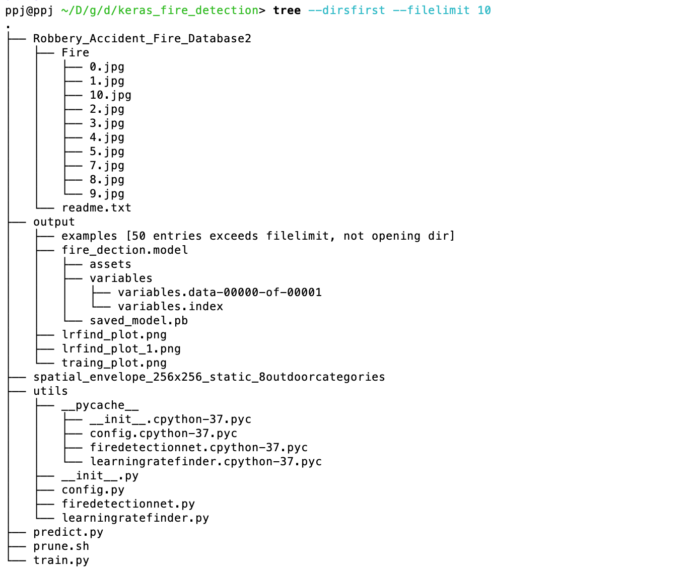
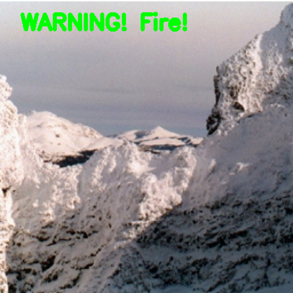
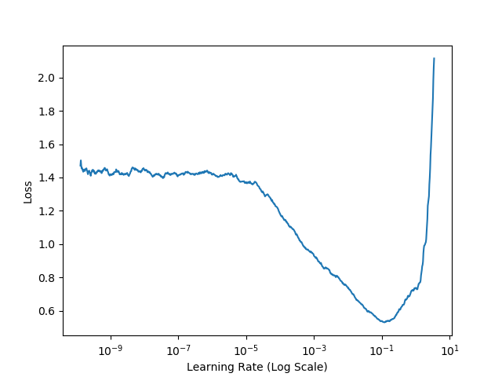
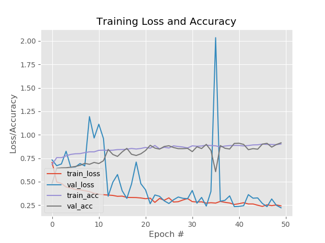

## 文件的目录结构


## 文件说明
#### 数据源集中在两个文件夹:
- /Robbery_Accident_Fire_Database2  包含了正样本的文件夹
- /spatial_envelope_256x256_static_8outdoorcategories  包含负样本的文件夹

**原始文件上传至百度网盘**

链接:https://pan.baidu.com/s/1ehQ54l8_T-Tvx4HK3bUr6A  
密码:xu0k

#### utils的文件说明
- config.py
相关的配置文件，存储在这个文件中，比如模型文件，数据路径等
- firedetectionnet.py
训练是否包含火的神经网络，主要是包含了三层神经网络
- learningratefinder.py
自动识别学习率的脚本

#### 剩余的文件
- train.py
主要是训练脚本
- predict.py
模型预测的脚本，可以生成output/examples中的案例结果

识别正确的结果：


识别错误的结果：



## 整个project的执行步骤3步
1. 先执行命令，生成最优的学习率
```
python train.py --lr-find 1
```

2. 修改config.py文件中的InIT_LR，设置最优的学习率。
```
python train.py
```

3. 生成预测结果
```
python predict.py
```

## 相关结果

### 查看最好的学习率

通过学习率和loss之间的关系，我们可以发现最好的学习率在1e-2到1e-1之间，所以可以设置这个初始的学习率，降低训练时长



### 模型训练的结果
通过绘制训练和测试集合的误差走势，最终的准确率在90%左右，随着迭代次数的加深，模型效率没有比较明显的提升，所以可以设置一个大概的epochs。


